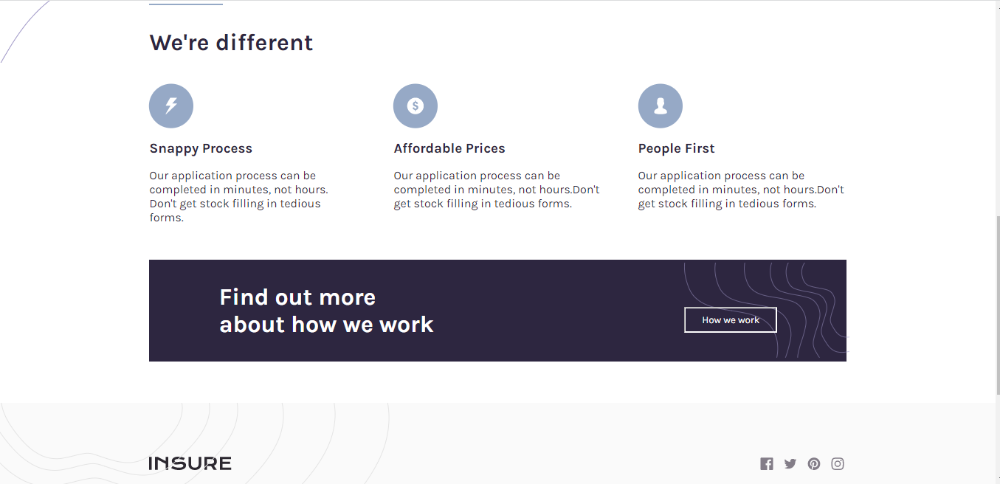

# Insure Landing Page

### This is a frontend coding challenge from Frontendmentor.io

## Welcome! 👋

Thanks for checking out my this projects, let's have fun.

[Frontend Mentor](https://www.frontendmentor.io) challenges help you improve your coding skills by building realistic projects.

## Overview

This is a frontend coding challenge to help you improve your coding skills... This is an interesting and challenging project I might add, without further ado, let's get started

## The challenge

Your challenge is to build out this landing page and get it looking as close to the design as possible.

You can use any tools you like to help you complete the challenge. So if you've got something you'd like to practice, feel free to give it a go.

Your users should be able to:

- View the optimal layout for the site depending on their device's screen size
- See hover states for all interactive elements on the page

### Screenshot

### mobile screenshot

### Links

- Solution URL: [solution](https://www.frontendmentor.io/solutions/react-job-listing-with-filtering-_TeWqNka8)
- Live Site URL: [live site](https://myjob-listing-react.netlify.app/);

## My process

**this project was created with "create-react-app"** from React: a frontend library for creating beautiful and interactive web applications.

> The styling were done with sass and also for responsiveness
> The goal is to create an optimal view and user friendly interface, usability and accessiblity for both desktop and mobile.

### Built with

- Semantic HTML5 markup
- CSS custom properties
- Flexbox
- CSS Grid
- Mobile-first workflow
- [React](https://reactjs.org/) - JS library

## Author

- Website - [Add your name here](https://ebukaeze.netlify.app)
- Frontend Mentor - [@kingbaddo](https://www.frontendmentor.io/profile/kingbaddo)
- Twitter - [@vikkzero](https://www.twitter.com/vikkzero)
